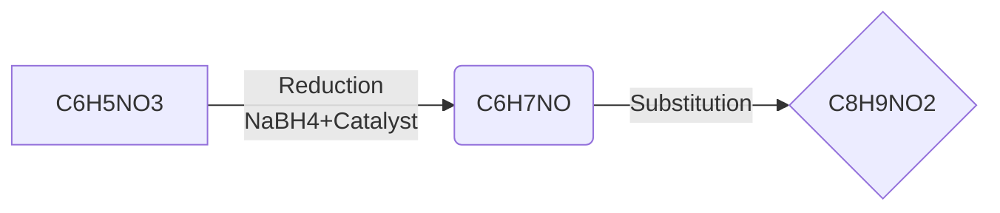

  <h1>Hello there!</h1>
   

  I am learning 
            **C++**
           without success, usually I'm working with 
  
           and 
            .

```mermaid
flowchart LR

A[C6H5NO3] -->|Reduction\nNaBH4+Catalyst| B(C6H7NO)
B --> |Substitution| C{C8H9NO2}
```

> [!IMPORTANT]
> My favourite drink is Tea
